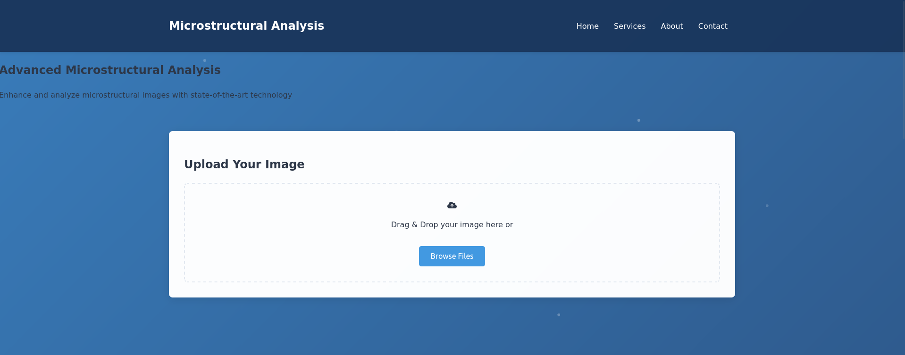

# Microstructural Analysis Portal

A web-based platform for microstructural image analysis and enhancement, built with Flask and modern web technologies. This repository contains code for creating and running the ML-based microstructure web service.


## Homepage Preview




## Features

- Image upload via drag-and-drop or file selection
- Interactive image comparison slider
- Real-time image enhancement
- Download enhanced images
- Feedback system for user input
- Help and FAQ section
- Responsive design for all devices

## Project Structure

```
microstructure-analysis-flask/
├── app.py                # Main Flask application
├── config.yml           # Configuration file
├── requirements.txt     # Python dependencies
├── README.md           # Project documentation
├── apps/               # Application modules
│   └── super_resolution/
│       ├── __init__.py  # Blueprint initialization
│       ├── routes.py    # Route handlers
│       ├── templates/   # HTML templates
│       └── static/      # Static files (JS, CSS, images)
├── models/             # ML models (future use)
└── utilities/          # Shared utilities
```

## Setup and Installation

1. Clone the repository:
```bash
git clone https://github.com/yourusername/microstructure-analysis-flask.git
cd microstructure-analysis-flask
```

2. Create a virtual environment:
```bash
python -m venv venv
source venv/bin/activate  # On Windows: venv\Scripts\activate
```

3. Install dependencies:
```bash
pip install -r requirements.txt
```

4. Run the application:
```bash
python app.py
```

The application will be available at `http://localhost:5000`

## Usage

1. Upload an image using drag-and-drop or the file selection button
2. The original image will appear on the right side
3. The enhanced image will appear on the left side
4. Use the slider to compare the original and enhanced images
5. Click the "Download Enhanced Image" button to save the processed image

## Development

### Adding New Features

1. Create a new module in the `apps` directory
2. Create a Blueprint for the new module
3. Register the Blueprint in `app.py`
4. Add routes, templates, and static files as needed

### Testing

Run tests using pytest:
```bash
pytest
```

### Contributing

1. Fork the repository
2. Create a feature branch
3. Make your changes
4. Submit a pull request

## Future Enhancements

- Integration of advanced ML models for super-resolution
- Database integration for feedback storage
- User authentication system
- Additional image processing features
- Advanced analysis tools

## License

This project is licensed under the MIT License - see the LICENSE file for details.

## Contact

For any queries or suggestions, please contact:
- Email: contact@microstructure.org
